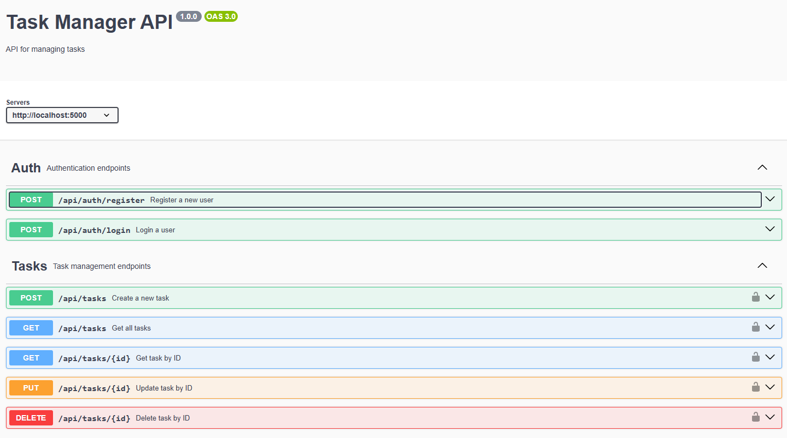

# Task Manager Backend

Este proyecto es el backend de una aplicación de gestión de tareas llamada "Task Manager". Permite a los usuarios crear, leer, actualizar y eliminar tareas. Además, incluye autenticación de usuarios y documentación de la API con Swagger.

## Requisitos

- Node.js v14 o superior
- MongoDB

## Instalación

1. Clona el repositorio:
   ```sh
   git clone <URL_DEL_REPOSITORIO>
   cd task-manager-backend
   ```

2. Instala las dependencias:
   ```sh
   npm install
   ```

3. Crea un archivo `.env` en la raíz del proyecto con las siguientes variables de entorno:
   ```env
   MONGO_URI=mongodb://localhost:27017/taskmanager
   JWT_SECRET=mysecretkey
   PORT=5000
   ```

4. Inicia el servidor:
   ```sh
   npm run dev
   ```

El servidor debería estar corriendo en `http://localhost:5000`.

## Endpoints

### Autenticación

#### Registro de Usuario

- **URL:** `/api/auth/register`
- **Método:** `POST`
- **Descripción:** Registra un nuevo usuario.
- **Cuerpo de la Solicitud:**
  ```json
  {
    "email": "user@example.com",
    "password": "password123"
  }
  ```
- **Respuestas:**
  - **200 OK:** Usuario registrado correctamente.
  - **400 Bad Request:** El usuario ya existe o los datos son inválidos.

#### Inicio de Sesión

- **URL:** `/api/auth/login`
- **Método:** `POST`
- **Descripción:** Inicia sesión un usuario.
- **Cuerpo de la Solicitud:**
  ```json
  {
    "email": "user@example.com",
    "password": "password123"
  }
  ```
- **Respuestas:**
  - **200 OK:** Inicio de sesión exitoso, retorna el token JWT.
  - **400 Bad Request:** Credenciales inválidas.

### Tareas

#### Crear Tarea

- **URL:** `/api/tasks`
- **Método:** `POST`
- **Descripción:** Crea una nueva tarea.
- **Encabezados:**
  - `x-auth-token`: Token JWT del usuario autenticado.
- **Cuerpo de la Solicitud:**
  ```json
  {
    "title": "Nueva Tarea",
    "description": "Descripción opcional"
  }
  ```
- **Respuestas:**
  - **200 OK:** Tarea creada correctamente.
  - **400 Bad Request:** El título es obligatorio.

#### Obtener Todas las Tareas

- **URL:** `/api/tasks`
- **Método:** `GET`
- **Descripción:** Obtiene todas las tareas del usuario autenticado.
- **Encabezados:**
  - `x-auth-token`: Token JWT del usuario autenticado.
- **Respuestas:**
  - **200 OK:** Lista de tareas del usuario.

#### Obtener Tarea por ID

- **URL:** `/api/tasks/:id`
- **Método:** `GET`
- **Descripción:** Obtiene una tarea específica por su ID.
- **Encabezados:**
  - `x-auth-token`: Token JWT del usuario autenticado.
- **Respuestas:**
  - **200 OK:** Detalles de la tarea.
  - **404 Not Found:** Tarea no encontrada.

#### Actualizar Tarea

- **URL:** `/api/tasks/:id`
- **Método:** `PUT`
- **Descripción:** Actualiza una tarea específica por su ID.
- **Encabezados:**
  - `x-auth-token`: Token JWT del usuario autenticado.
- **Cuerpo de la Solicitud:**
  ```json
  {
    "title": "Tarea Actualizada",
    "description": "Descripción actualizada",
    "completed": true
  }
  ```
- **Respuestas:**
  - **200 OK:** Tarea actualizada correctamente.
  - **404 Not Found:** Tarea no encontrada.

#### Eliminar Tarea

- **URL:** `/api/tasks/:id`
- **Método:** `DELETE`
- **Descripción:** Elimina una tarea específica por su ID.
- **Encabezados:**
  - `x-auth-token`: Token JWT del usuario autenticado.
- **Respuestas:**
  - **200 OK:** Tarea eliminada correctamente.
  - **404 Not Found:** Tarea no encontrada.

## Documentación de la API

La documentación de la API está disponible en Swagger. Para acceder a ella, visita `http://localhost:5000/api-docs` después de iniciar el servidor.




## Despliegue

### Despliegue en Render

1. Crea una cuenta en [Render](https://render.com/) y crea un nuevo servicio web.
2. Conecta tu repositorio de GitHub.
3. Configura las variables de entorno (`MONGO_URI`, `JWT_SECRET`, `PORT`).
4. Despliega el servicio.

### Despliegue en Railway

1. Crea una cuenta en [Railway](https://railway.app/) y crea un nuevo proyecto.
2. Conecta tu repositorio de GitHub.
3. Configura las variables de entorno (`MONGO_URI`, `JWT_SECRET`, `PORT`).
4. Despliega el proyecto.

## Pruebas

Para ejecutar las pruebas, utiliza el siguiente comando:
```sh
npm test
```

Las pruebas están escritas usando Jest y Supertest. Asegúrate de que la base de datos de pruebas esté configurada correctamente en el archivo `.env`

## Contribuciones

Las contribuciones son bienvenidas. Para contribuir, por favor sigue estos pasos:

1. Haz un fork del proyecto.
2. Crea una nueva rama (`git checkout -b feature/nueva-funcionalidad`).
3. Realiza tus cambios y haz un commit (`git commit -am 'Agregar nueva funcionalidad'`).
4. Haz un push a la rama (`git push origin feature/nueva-funcionalidad`).
5. Abre un Pull Request.

## Licencia

Este proyecto está bajo la Licencia MIT. Consulta el archivo [LICENSE](LICENSE) para más detalles.